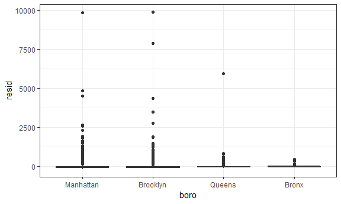
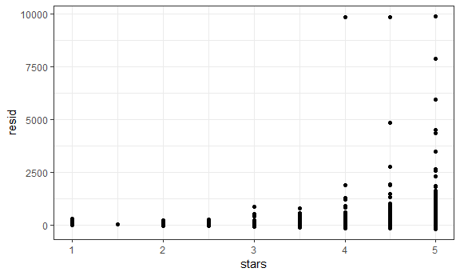
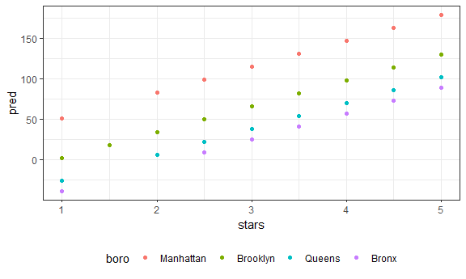
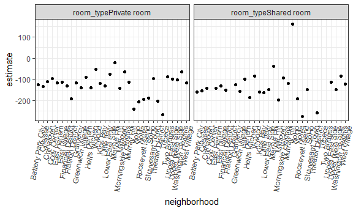
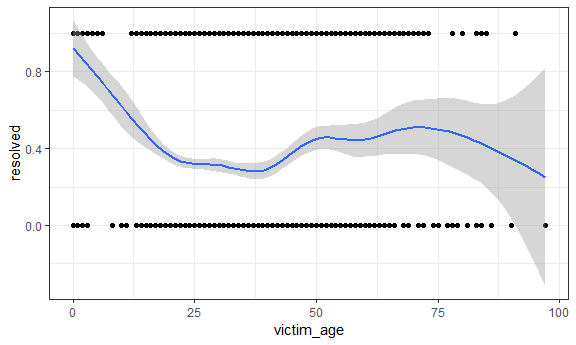

Linear Models
================

Examples
--------

AirBnB

``` r
data("nyc_airbnb")

nyc_airbnb = 
  nyc_airbnb %>% 
  mutate(stars = review_scores_location / 2) %>% 
  rename(boro = neighbourhood_group,
         neighborhood = neighbourhood) %>% 
  filter(boro != "Staten Island") %>% 
  select(price, stars, boro, neighborhood, room_type)
```

Fit a model for price as an outcome

``` r

fit = lm(price ~ stars + boro, data = nyc_airbnb)
```

Look at summaries

``` r
summary(fit)
## 
## Call:
## lm(formula = price ~ stars + boro, data = nyc_airbnb)
## 
## Residuals:
##    Min     1Q Median     3Q    Max 
## -169.8  -64.0  -29.0   20.2 9870.0 
## 
## Coefficients:
##               Estimate Std. Error t value Pr(>|t|)    
## (Intercept)    -70.414     14.021  -5.022 5.14e-07 ***
## stars           31.990      2.527  12.657  < 2e-16 ***
## boroBrooklyn    40.500      8.559   4.732 2.23e-06 ***
## boroManhattan   90.254      8.567  10.534  < 2e-16 ***
## boroQueens      13.206      9.065   1.457    0.145    
## ---
## Signif. codes:  0 '***' 0.001 '**' 0.01 '*' 0.05 '.' 0.1 ' ' 1
## 
## Residual standard error: 181.5 on 30525 degrees of freedom
##   (9962 observations deleted due to missingness)
## Multiple R-squared:  0.03423,    Adjusted R-squared:  0.03411 
## F-statistic: 270.5 on 4 and 30525 DF,  p-value: < 2.2e-16
summary(fit)$coef
##                Estimate Std. Error   t value     Pr(>|t|)
## (Intercept)   -70.41446  14.020697 -5.022180 5.137589e-07
## stars          31.98989   2.527500 12.656733 1.269392e-36
## boroBrooklyn   40.50030   8.558724  4.732049 2.232595e-06
## boroManhattan  90.25393   8.567490 10.534465 6.638618e-26
## boroQueens     13.20617   9.064879  1.456850 1.451682e-01
coef(fit)
##   (Intercept)         stars  boroBrooklyn boroManhattan    boroQueens 
##     -70.41446      31.98989      40.50030      90.25393      13.20617
# fitted.values(fit)
```

Look at better summaries...

``` r

fit %>% 
  broom::tidy()
## # A tibble: 5 x 5
##   term          estimate std.error statistic  p.value
##   <chr>            <dbl>     <dbl>     <dbl>    <dbl>
## 1 (Intercept)      -70.4     14.0      -5.02 5.14e- 7
## 2 stars             32.0      2.53     12.7  1.27e-36
## 3 boroBrooklyn      40.5      8.56      4.73 2.23e- 6
## 4 boroManhattan     90.3      8.57     10.5  6.64e-26
## 5 boroQueens        13.2      9.06      1.46 1.45e- 1

fit %>% 
  broom::tidy() %>% 
  select(term, estimate, p.value) %>% 
  mutate(term = str_replace(term, "^boro", "Boro: ")) %>% 
  knitr::kable(digits = 3)
```

| term            |  estimate|  p.value|
|:----------------|---------:|--------:|
| (Intercept)     |   -70.414|    0.000|
| stars           |    31.990|    0.000|
| Boro: Brooklyn  |    40.500|    0.000|
| Boro: Manhattan |    90.254|    0.000|
| Boro: Queens    |    13.206|    0.145|

Look at other summaries...

``` r
fit %>% 
  broom::glance()
## # A tibble: 1 x 11
##   r.squared adj.r.squared sigma statistic   p.value    df  logLik    AIC
## *     <dbl>         <dbl> <dbl>     <dbl>     <dbl> <int>   <dbl>  <dbl>
## 1    0.0342        0.0341  182.      271. 6.73e-229     5 -2.02e5 4.04e5
## # ... with 3 more variables: BIC <dbl>, deviance <dbl>, df.residual <int>

fit %>% 
  broom::glance() %>% 
  select(r.squared, adj.r.squared)
## # A tibble: 1 x 2
##   r.squared adj.r.squared
## *     <dbl>         <dbl>
## 1    0.0342        0.0341
```

Be carefu with factor order...

``` r
nyc_airbnb = 
  nyc_airbnb %>% 
  mutate(boro = fct_infreq(boro),  # in order of frequency
         room_type = fct_infreq(room_type))

fit = lm(price ~ stars + boro, data = nyc_airbnb)

fit %>% 
  broom::tidy()
## # A tibble: 5 x 5
##   term         estimate std.error statistic   p.value
##   <chr>           <dbl>     <dbl>     <dbl>     <dbl>
## 1 (Intercept)      19.8     12.2       1.63 1.04e-  1
## 2 stars            32.0      2.53     12.7  1.27e- 36
## 3 boroBrooklyn    -49.8      2.23    -22.3  6.32e-109
## 4 boroQueens      -77.0      3.73    -20.7  2.58e- 94
## 5 boroBronx       -90.3      8.57    -10.5  6.64e- 26
```

Diagnostics
-----------

Add residuals to dataset

``` r
modelr::add_residuals(nyc_airbnb, fit)
## # A tibble: 40,492 x 6
##    price stars boro  neighborhood room_type        resid
##    <int> <dbl> <fct> <chr>        <fct>            <dbl>
##  1    99   5   Bronx City Island  Private room      9.47
##  2   200  NA   Bronx City Island  Private room     NA   
##  3   300  NA   Bronx City Island  Entire home/apt  NA   
##  4   125   5   Bronx City Island  Entire home/apt  35.5 
##  5    69   5   Bronx City Island  Private room    -20.5 
##  6   125   5   Bronx City Island  Entire home/apt  35.5 
##  7    85   5   Bronx City Island  Entire home/apt  -4.53
##  8    39   4.5 Bronx Allerton     Private room    -34.5 
##  9    95   5   Bronx Allerton     Entire home/apt   5.47
## 10   125   4.5 Bronx Allerton     Entire home/apt  51.5 
## # ... with 40,482 more rows

modelr::add_predictions(nyc_airbnb, fit)
## # A tibble: 40,492 x 6
##    price stars boro  neighborhood room_type        pred
##    <int> <dbl> <fct> <chr>        <fct>           <dbl>
##  1    99   5   Bronx City Island  Private room     89.5
##  2   200  NA   Bronx City Island  Private room     NA  
##  3   300  NA   Bronx City Island  Entire home/apt  NA  
##  4   125   5   Bronx City Island  Entire home/apt  89.5
##  5    69   5   Bronx City Island  Private room     89.5
##  6   125   5   Bronx City Island  Entire home/apt  89.5
##  7    85   5   Bronx City Island  Entire home/apt  89.5
##  8    39   4.5 Bronx Allerton     Private room     73.5
##  9    95   5   Bronx Allerton     Entire home/apt  89.5
## 10   125   4.5 Bronx Allerton     Entire home/apt  73.5
## # ... with 40,482 more rows


modelr::add_residuals(nyc_airbnb, fit) %>% 
  ggplot(aes(x = boro, y = resid)) + geom_boxplot()
## Warning: Removed 9962 rows containing non-finite values (stat_boxplot).
```



``` r

modelr::add_residuals(nyc_airbnb, fit) %>% 
  ggplot(aes(x = stars, y = resid)) + geom_point()
## Warning: Removed 9962 rows containing missing values (geom_point).
```



``` r

nyc_airbnb %>% 
  modelr::add_predictions(fit) %>% 
  ggplot(aes(x = stars, y = pred, color = boro)) + geom_point()
## Warning: Removed 9962 rows containing missing values (geom_point).
```



Testing
-------

``` r
fit %>% 
  broom::tidy()
## # A tibble: 5 x 5
##   term         estimate std.error statistic   p.value
##   <chr>           <dbl>     <dbl>     <dbl>     <dbl>
## 1 (Intercept)      19.8     12.2       1.63 1.04e-  1
## 2 stars            32.0      2.53     12.7  1.27e- 36
## 3 boroBrooklyn    -49.8      2.23    -22.3  6.32e-109
## 4 boroQueens      -77.0      3.73    -20.7  2.58e- 94
## 5 boroBronx       -90.3      8.57    -10.5  6.64e- 26
```

Compare nested models

``` r
fit_null = lm(price ~ stars + boro, data = nyc_airbnb)
fit_alt = lm(price ~ stars + boro + room_type, data = nyc_airbnb)

anova(fit_null, fit_alt) %>% 
  broom::tidy()
## Warning: Unknown or uninitialised column: 'term'.
## # A tibble: 2 x 6
##   res.df         rss    df     sumsq statistic p.value
## *  <dbl>       <dbl> <dbl>     <dbl>     <dbl>   <dbl>
## 1  30525 1005601724.    NA       NA        NA       NA
## 2  30523  921447496.     2 84154228.     1394.       0
```

### Nested data

``` r
nyc_airbnb %>% 
  lm(price ~ stars * boro + room_type * boro, data = .) %>% 
  broom::tidy() %>% 
  knitr::kable(digits = 3)
```

| term                                |  estimate|  std.error|  statistic|  p.value|
|:------------------------------------|---------:|----------:|----------:|--------:|
| (Intercept)                         |    95.694|     19.184|      4.988|    0.000|
| stars                               |    27.110|      3.965|      6.838|    0.000|
| boroBrooklyn                        |   -26.066|     25.080|     -1.039|    0.299|
| boroQueens                          |    -4.118|     40.674|     -0.101|    0.919|
| boroBronx                           |    -5.627|     77.808|     -0.072|    0.942|
| room\_typePrivate room              |  -124.188|      2.996|    -41.457|    0.000|
| room\_typeShared room               |  -153.635|      8.692|    -17.676|    0.000|
| stars:boroBrooklyn                  |    -6.139|      5.237|     -1.172|    0.241|
| stars:boroQueens                    |   -17.455|      8.539|     -2.044|    0.041|
| stars:boroBronx                     |   -22.664|     17.099|     -1.325|    0.185|
| boroBrooklyn:room\_typePrivate room |    31.965|      4.328|      7.386|    0.000|
| boroQueens:room\_typePrivate room   |    54.933|      7.459|      7.365|    0.000|
| boroBronx:room\_typePrivate room    |    71.273|     18.002|      3.959|    0.000|
| boroBrooklyn:room\_typeShared room  |    47.797|     13.895|      3.440|    0.001|
| boroQueens:room\_typeShared room    |    58.662|     17.897|      3.278|    0.001|
| boroBronx:room\_typeShared room     |    83.089|     42.451|      1.957|    0.050|

Nest dataset and then fit model...(stratified analysis)

``` r
nest_lm_res =
  nyc_airbnb %>% 
  group_by(boro) %>% 
  nest() %>% 
  mutate(models = map(data, ~lm(price ~ stars + room_type, data = .x)),
         models = map(models, broom::tidy)) %>% 
  select(-data) %>% 
  unnest()
```

Only neighborhoods in Manhattan

``` r
manhattan_airbnb =
  nyc_airbnb %>% 
  filter(boro == "Manhattan")

manhattan_nest_lm_res =
  manhattan_airbnb %>% 
  group_by(neighborhood) %>% 
  nest() %>% 
  mutate(models = map(data, ~lm(price ~ stars + room_type, data = .x)),
         models = map(models, broom::tidy)) %>% 
  select(-data) %>% 
  unnest()
```

View some results... differences among room types

``` r
manhattan_nest_lm_res %>% 
  filter(str_detect(term, "room_type")) %>% 
  ggplot(aes(x = neighborhood, y = estimate)) + 
  geom_point() + 
  facet_wrap(~term) + 
  theme(axis.text.x = element_text(angle = 80, hjust = 1))
```



Mixed model with neighborhood-level random intercepts and random slopes for room type

``` r
#manhattan_airbnb %>% 
 # lme4::lmer(price ~ stars + room_type + (1 + room_type | neighborhood), data = .) %>% 
  # broom::tidy()
```

Binary Outcomes
---------------

``` r
baltimore_df = 
  read_csv("data/homicide-data.csv") %>% 
  filter(city == "Baltimore") %>% 
  mutate(resolved = as.numeric(disposition == "Closed by arrest"),
         victim_age = as.numeric(victim_age),
         victim_race = fct_relevel(victim_race, "White")) %>% 
  select(resolved, victim_age, victim_race, victim_sex)
## Parsed with column specification:
## cols(
##   uid = col_character(),
##   reported_date = col_integer(),
##   victim_last = col_character(),
##   victim_first = col_character(),
##   victim_race = col_character(),
##   victim_age = col_character(),
##   victim_sex = col_character(),
##   city = col_character(),
##   state = col_character(),
##   lat = col_double(),
##   lon = col_double(),
##   disposition = col_character()
## )
```

``` r
fit_logistic = 
  baltimore_df %>% 
  glm(resolved ~ victim_age + victim_race + victim_sex, 
      data = ., 
      family = binomial()) 
```

``` r
fit_logistic %>% 
  broom::tidy() %>% 
  mutate(OR = exp(estimate)) %>%
  select(term, log_OR = estimate, OR, p.value) %>% 
  knitr::kable(digits = 3)
```

| term                 |  log\_OR|     OR|  p.value|
|:---------------------|--------:|------:|--------:|
| (Intercept)          |    1.190|  3.287|    0.000|
| victim\_age          |   -0.007|  0.993|    0.027|
| victim\_raceAsian    |    0.296|  1.345|    0.653|
| victim\_raceBlack    |   -0.842|  0.431|    0.000|
| victim\_raceHispanic |   -0.265|  0.767|    0.402|
| victim\_raceOther    |   -0.768|  0.464|    0.385|
| victim\_sexMale      |   -0.880|  0.415|    0.000|

``` r


fit_logistic %>% 
  broom::tidy() %>% 
  mutate(OR = boot::inv.logit(estimate)) %>%
  knitr::kable(digits = 3)
```

| term                 |  estimate|  std.error|  statistic|  p.value|     OR|
|:---------------------|---------:|----------:|----------:|--------:|------:|
| (Intercept)          |     1.190|      0.235|      5.067|    0.000|  0.767|
| victim\_age          |    -0.007|      0.003|     -2.215|    0.027|  0.498|
| victim\_raceAsian    |     0.296|      0.660|      0.449|    0.653|  0.574|
| victim\_raceBlack    |    -0.842|      0.175|     -4.815|    0.000|  0.301|
| victim\_raceHispanic |    -0.265|      0.317|     -0.837|    0.402|  0.434|
| victim\_raceOther    |    -0.768|      0.883|     -0.870|    0.385|  0.317|
| victim\_sexMale      |    -0.880|      0.136|     -6.446|    0.000|  0.293|

``` r
baltimore_df %>% 
  modelr::add_predictions(fit_logistic) %>% 
  mutate(fitted_prob = boot::inv.logit(pred))
## # A tibble: 2,827 x 6
##    resolved victim_age victim_race victim_sex    pred fitted_prob
##       <dbl>      <dbl> <fct>       <chr>        <dbl>       <dbl>
##  1        0         17 Black       Male       -0.654        0.342
##  2        0         26 Black       Male       -0.720        0.327
##  3        0         21 Black       Male       -0.683        0.335
##  4        1         61 White       Male       -0.131        0.467
##  5        1         46 Black       Male       -0.864        0.296
##  6        1         27 Black       Male       -0.727        0.326
##  7        1         21 Black       Male       -0.683        0.335
##  8        1         16 Black       Male       -0.647        0.344
##  9        1         21 Black       Male       -0.683        0.335
## 10        1         44 Black       Female      0.0297       0.507
## # ... with 2,817 more rows
```

``` r
baltimore_df %>% 
  ggplot(aes(x = victim_age, y = resolved)) +
    geom_point() + geom_smooth()
## `geom_smooth()` using method = 'gam' and formula 'y ~ s(x, bs = "cs")'
```


